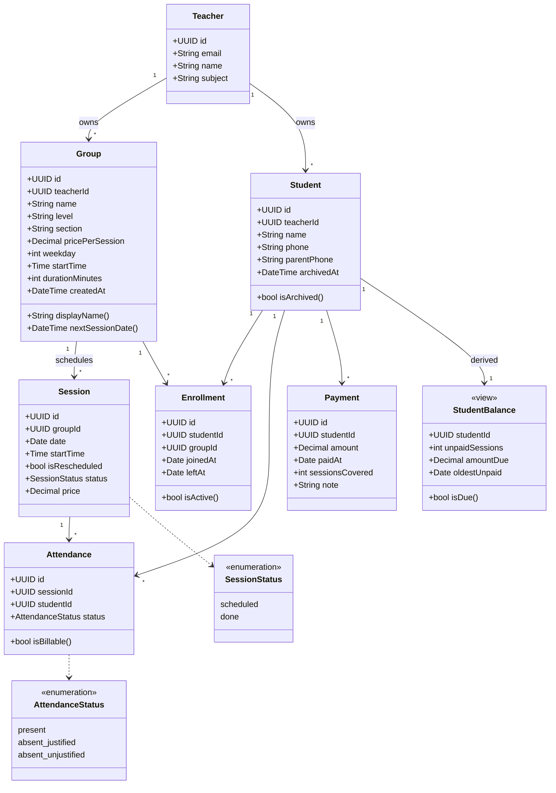
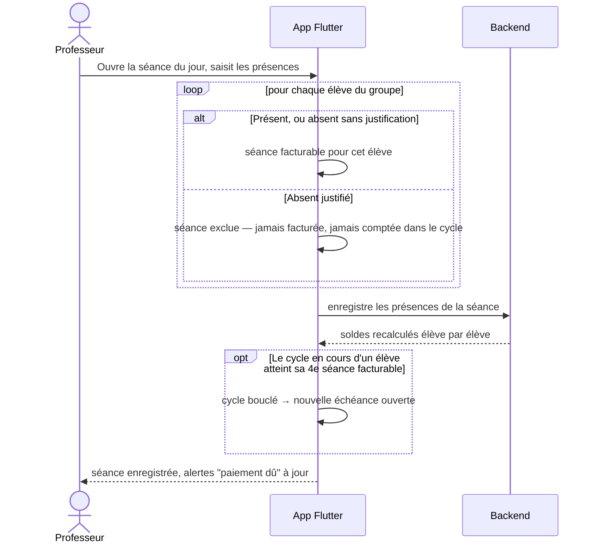
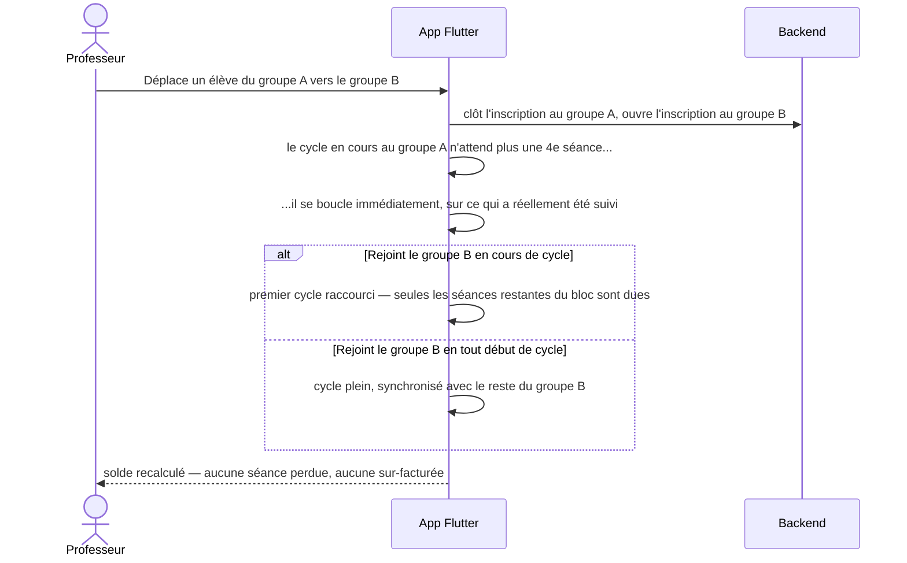
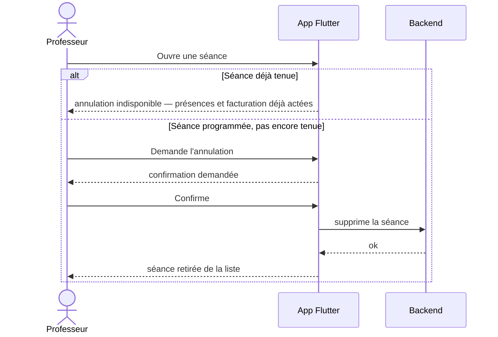
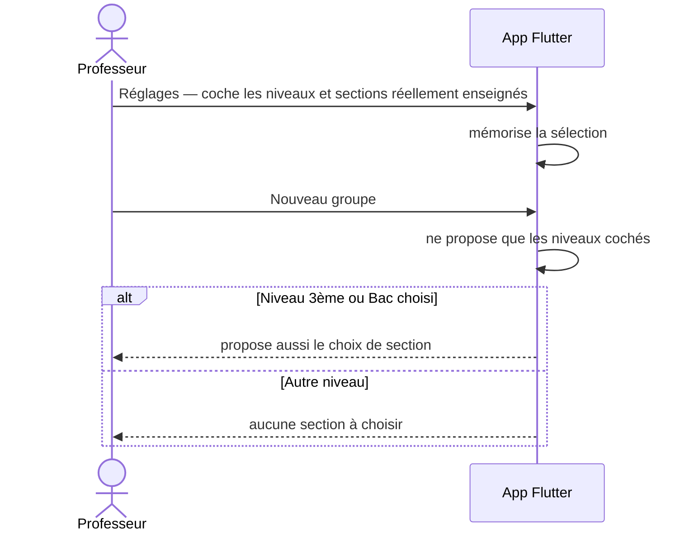

# elCarni

Application mobile permettant à un professeur particulier de gérer ses groupes d'élèves, le suivi des présences et les paiements par cycles de séances.


*Élèves, numéros et montants affichés sont des données fictives du jeu d'essai — aucune donnée personnelle réelle n'est exposée.*

---

## Sommaire

- [1. Fonctionnalités](#1-fonctionnalités)
- [2. Modèle de données](#2-modèle-de-données)
- [3. Diagramme de classes](#3-diagramme-de-classes)
- [4. Règle de facturation](#4-règle-de-facturation)
- [5. Diagrammes de séquence](#5-diagrammes-de-séquence)
- [6. Créneaux et cycle de vie des élèves](#6-créneaux-et-cycle-de-vie-des-élèves)
- [7. Stack technique](#7-stack-technique)
- [8. Démarrage](#8-démarrage)

---

## 1. Fonctionnalités

- **Groupes** — création par niveau (collège 7ème-9ème, secondaire 1ère à Bac) et, pour 3ème/Bac, par section (Maths, Sciences exp., Technique, Info, Éco, Lettres), avec créneau horaire hebdomadaire et tarif dédiés.
- **Élèves** — fiche par élève indépendante du groupe : ajout, modification, archivage puis suppression, déplacement d'un groupe à l'autre sans perdre l'historique de présence ni de paiement.
- **Séances** — programmation à partir du créneau du groupe, modification ponctuelle (date/heure ou déplacement exceptionnel), annulation (la séance programmée est alors supprimée), et prise de présence en trois états : présent, absent justifié, absent non justifié.
- **Paiements** — suivi des séances dues et encaissées par élève, quel que soit le nombre de groupes traversés dans le temps. Une absence justifiée n'est jamais facturée.
- **Réglages** — le professeur choisit les niveaux et sections qu'il enseigne réellement, ce qui simplifie les listes proposées à la création d'un groupe et dans les filtres.
- **Appel rapide** — contacter un élève ou son parent directement depuis sa fiche.

---

## 2. Modèle de données

Sept entités, dont deux vues calculées.

| Entité | Rôle |
|---|---|
| `Teacher` | Le professeur et sa matière |
| `Group` | Niveau + section + tarif par défaut + créneau hebdomadaire |
| `Student` | Fiche élève, indépendante du groupe, archivable |
| `Enrollment` | Association élève ↔ groupe, historisée (un élève peut quitter puis revenir) |
| `Session` | Une séance datée d'un groupe, avec prix figé au moment de sa création |
| `Attendance` | Statut de présence d'un élève à une séance |
| `Payment` | Encaissement, rattaché à l'élève seul — jamais à un groupe |
| `StudentBalance` *(dérivée)* | Solde agrégé par élève, jamais stocké : toujours recalculé depuis les présences et paiements |

Deux caractéristiques notables :

- **Le prix d'une séance est figé à sa création.** Comme un cycle de facturation peut traverser deux groupes à des tarifs différents, le montant dû ne peut pas dépendre du tarif courant du groupe — changer son tarif ne réécrit donc jamais l'historique.
- **Les paiements ne sont pas rattachés à un groupe.** Conséquence directe du fait que les séances impayées suivent l'élève lors d'un déplacement : le cycle de facturation est global à l'élève.

---

## 3. Diagramme de classes



---

## 4. Règle de facturation

**Une séance facturable** = l'élève y était présent, ou absent sans justification. Une absence justifiée, ou une séance annulée, ne facture personne.

Les séances facturables d'un élève sont regroupées en **cycles** de 4, dans l'ordre chronologique du groupe suivi — pas dans l'ordre propre à l'élève. Concrètement :

- Un élève qui rejoint un groupe en cours de route n'a que les séances restantes à payer pour boucler son premier cycle (par exemple 3 séances s'il arrive à la 2e séance d'un bloc de 4), puis retombe sur des cycles pleins synchronisés avec le reste du groupe.
- Un élève peut régler d'avance dès la première séance impayée du cycle en cours — pas besoin d'attendre que les 4 séances aient eu lieu.
- Si un élève quitte un groupe avant d'avoir bouclé son cycle en cours, ce cycle se clôture immédiatement sur ce qu'il a réellement suivi. S'il revient plus tard dans le même groupe, c'est un nouveau passage, avec son propre calage de cycle — sans se mélanger à l'ancien.
- Un élève inscrit dans deux groupes au fil du temps voit son solde fusionné sur une seule échéance ; le détail par groupe reste consultable.

---

## 5. Diagrammes de séquence

Les quatre flux ci-dessous ne sont pas de simples CRUD : ce sont les endroits où l'app prend une vraie décision métier.

### 5.1 Présence d'une séance et effet immédiat sur la facturation



### 5.2 Déplacement d'un élève en cours de cycle



### 5.3 Annulation d'une séance



### 5.4 Réglages du professeur et création d'un groupe



---

## 6. Créneaux et cycle de vie des élèves

### Créneau du groupe

Chaque groupe porte un créneau hebdomadaire (jour, heure, durée). À la création d'une séance, l'app propose la prochaine occurrence de ce créneau : le professeur valide en un geste, ou ajuste ponctuellement la date/l'heure sans modifier le créneau habituel du groupe.

### Cycle de vie d'un élève

1. **Actif** — inscrit dans au moins un groupe.
2. **Archivé** — disparaît des listes de présence mais reste visible dans le suivi des impayés ; son historique est intact et l'archivage est réversible.
3. **Supprimé** — définitif, uniquement possible une fois le solde de l'élève à zéro.

---

## 7. Stack technique

- **Flutter** — application mobile, une seule base de code pour Android/iOS.
- **Supabase** (Postgres, authentification, Row Level Security) — backend prévu pour la persistance ; l'application fonctionne aujourd'hui sur des données en mémoire, le temps de finaliser le modèle de données.

---

## 8. Démarrage

```bash
flutter pub get
flutter run
```
